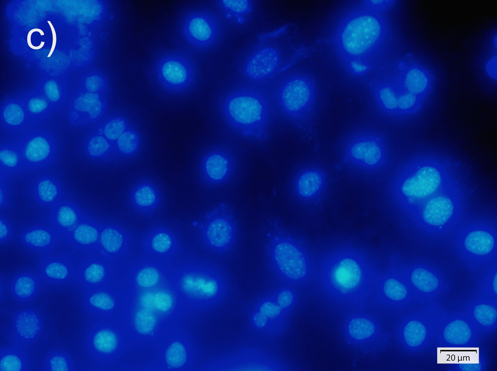

Emisión de luz en sistemas orgánicos nanoestructurados y funcionalizados
================================================================

Una tesis de licenciatura por Itzel Isunza Manrique

Copyright (C) 2012 Itzel Isunza Manrique

En este trabajo se presenta un estudio de las propiedades \'opticas m\'as relevantes de nuevos sistemas moleculares org\'anicos para el desarrollo de marcadores biocompatibles en microscop\'ia de fluorescencia.

Se realiz\'o una comparaci\'on entre la actividad \'optica de estos materiales en soluci\'on y en suspensiones acuosas de nanopart\'iculas, fabricadas mediante el m\'etodo de reprecipitaci\'on. Para ello se obtuvieron espectros de absorci\'on en el rango UV-visible y espectros de emisi\'on lineal utilizando una fuente de excitaci\'on de 370 nm. Se determinaron adem\'as los valores de eficiencia cu\'antica de fluorescencia utilizando una esfera integradora. 

Adicionalmente se obtuvieron los valores de secci\'on transversal de absorci\'on de dos fotones en el rango de inter\'es biom\'edico (740- 840$nm$ y 650- 760$nm$) mediante la t\'ecnica de emisi\'on inducida por absorci\'on de dos fotones, TPEF por sus siglas en ingles. En el rango de 740 a 840 $nm$ se utiliz\'o un l\'aser de Ti: Za con pulsos de 100 $fs$ y frecuencia de repetici\'on de 80 $MHz$; para longitudes de onda de 650 a 760 nm se utiliz\'o un amplificador ultrarr\'apido con emisi\'on de pulsos de 50 $fs$ y frecuencia de 1 $kHz$.
    
Por otra parte, se realizaron estudios para desarrollar y optimizar una transferencia de energía de resonancia Förster en suspensiones acuosas de nanopartículas, realizando posteriormente una caracterización óptica.     
    
Se desarroll\'o una metodolog\'ia para la fabricaci\'on de nanopart\'iculas org\'anicas funcionalizadas con dos tipos de Polietilenglicol (PEG) y se estudiaron efectos en las propiedades \'opticas. Las nanopart\'iculas funcionalizadas que presentaron propiedades fluorescentes y que resultaron de mayor inter\'es se sometieron a un estudio de fotoestabilidad para finalmente ser internalizadas en c\'elulas epiteliales L929 y obtener im\'agenes (micro- im\'agenes) con un microscopio \de epifluorescencia.
